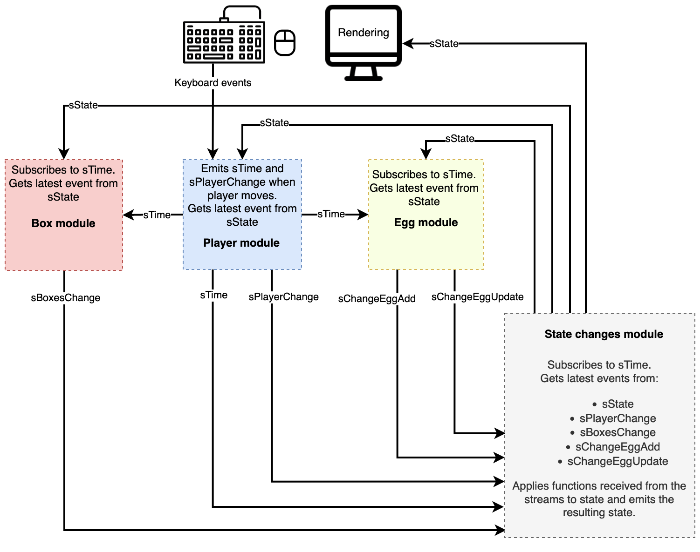

<h1 align="center">Boxes and Eggs</h1>

<b><a href="https://boxes-and-eggs.firebaseapp.com/">Play with the live demo</a></b>

	

# Gameplay

## Player

Your player is a blue square with big eyes and a small smile. You move him using the arrow keys.

Time in the game is dependent on the player. The other charecters will only move after the player has moved.

The player has the ability to destroy eggs. Moving the player onto a cell with an egg destroys it.

## Box

Boxes are red squares with small eyes and wide smiles. They move randomly and are not hostile towards the player.

On random occasions, they will lay an egg.

Boxes can never be killed.

## Egg

Eggs are egg-shaped and egg-colored. Once laid, they count down every time the player moves, starting from 10. When they reach 0, they hatch and a new box is born.

## Objective

The objective is to get the highest score before the game ends. The score is incremented each time your player moves.

## How the game ends

The game ends if your player is surrounded on all sides by boxes.

# Motivation

This is a toy project meant to help me learn the patterns of Functional Reactive Programming ([FRP](https://en.wikipedia.org/wiki/Functional_reactive_programming)). It's made with inspiration and knowledge from the book [Functional Reactive Programming by Stephen Blackheath and Anthony Jones](https://www.manning.com/books/functional-reactive-programming).

# How the game is structured

Below is a diagram that illustrates how the game is structured.

A name starting with "`s`" e.g. `sPlayerChange` represents a stream of events. 

Most streams emit functions that take a state object as an argument and returns a new state object. An example is `sPlayerChange` which emits functions that return a modified state where the player is moved to another cell.

All such emitted functions are gathered in the State changes module (found in [index.ts](/src/index.ts)), which applies them to the old state and emits a new state.

 
# License

This project is licensed under the MIT License - see the [LICENSE](LICENSE) file for details.

