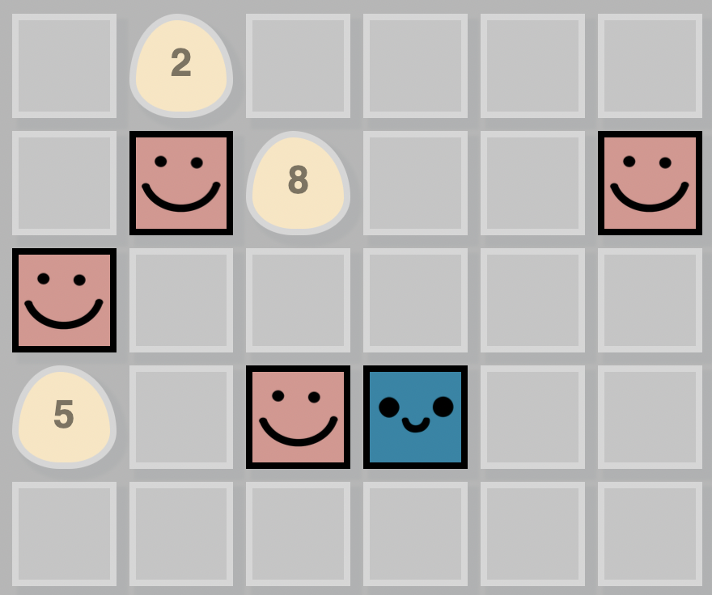
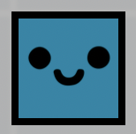
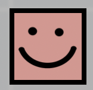
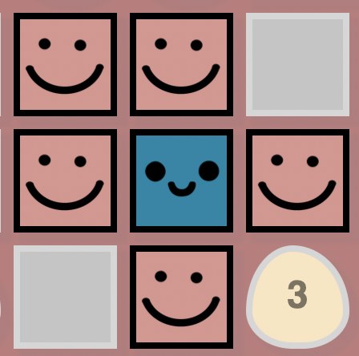

<h1 align="center">Boxes and Eggs</h1>

<b><a href="https://boxes-and-eggs.web.app/">Play with the live demo</a></b>

	

# Gameplay

## Player

Your player is a blue square with big eyes and a small smile. You move him using the arrow keys.

Time in the game is dependent on the player. The other charecters will only move after the player has moved.

The player has the ability to destroy eggs. Moving the player onto a cell with an egg destroys it.

## Box

Boxes are red squares with small eyes and wide smiles. They move randomly and are not hostile towards the player.

On random occasions, they will lay an egg.

Boxes can never be killed.

## Egg

Eggs are egg-shaped and egg-colored. Once laid, they count down every time the player moves, starting from 10. When they reach 0, they hatch and a new box is born.

## Objective

To get the highest score before the game ends. The score is incremented each time your player moves.

## How the game ends

The game ends if your player is surrounded on all sides by boxes.

# Motivation

# License

This project is licensed under the MIT License - see the [LICENSE](LICENSE) file for details.

